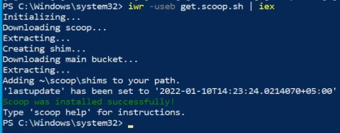
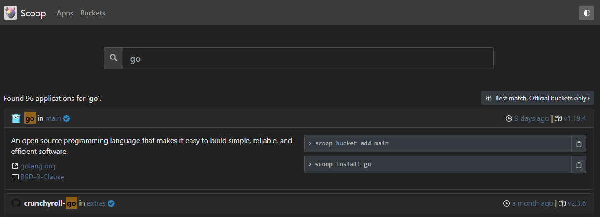
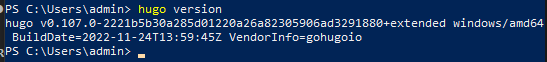
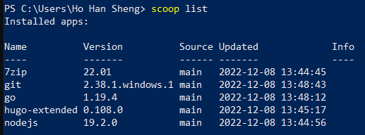
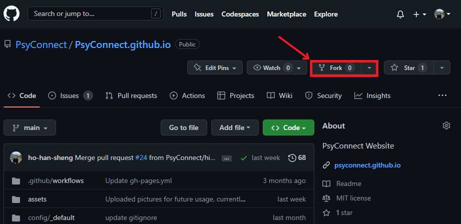
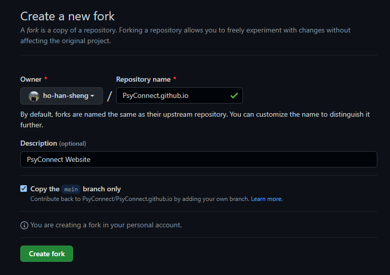
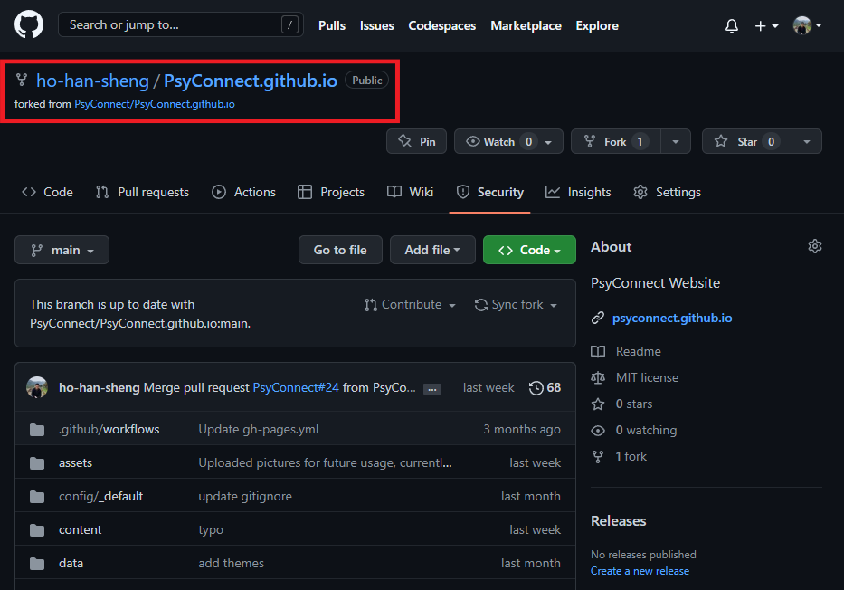

# Getting Started

## Setting up GitHub

You may find the following video useful:

[](https://youtu.be/8Dd7KRpKeaE "Git, GitHub, & GitHub Desktop for beginners")

Essentially, Git is a version control software (VCS) and GitHub is a website that allows us to host our code online.

### Github Account

This account is required for you to collaborate and interact with our codebase. As all profiles and commits are **public**, we highly suggest choosing a professional handle and one that allows reviewers to clearly identify you.

You may also refer to [GitHub's exisiting guides and documentation](https://docs.github.com/en).

## Installing Prerequisite Software

You do not need to install both [Scoop](#scoop-for-windows) and [Homebrew](#homebrew-for-macos). Choose the relevant package manager for the operating system you are working on (Windows or MacOS).

> ❗ Make sure you install a package manager before the rest of the software to prevent unnecessary headaches

### Scoop for Windows

You may refer to [Scoop documentation](https://scoop.sh/).

1. Open Windows Powershell by typing in the search bar:


2. Copy and paste the following code into the command-line (this is optional if you are not running a remote script for the first time):

```powershell
Set-ExecutionPolicy RemoteSigned -Scope CurrentUser
```

3. You may receive a prompt alerting you to the change in execution policy, answer yes to this with Y:


4. Copy and paste the following code into the command-line:

```powershell
irm get.scoop.sh | iex
```

5. Wait for scoop to install



For the following software, you may use [scoop's search function](https://scoop.sh/) to search for the relevant installation commands (in the event that commands listed here are outdated).



### Homebrew for MacOS

You may refer to the [Homebrew documentation](https://brew.sh/).

For the following software, you may use [homebrew's package browser](https://formulae.brew.sh/) to search for the relevant installation commands (in the event that commands listed here are outdated).


### Git

[Git](https://git-scm.com/) is our VCS of choice.

For Windows scoop users, simply input the following in powershell:

```powershell
scoop install git
```

For MacOS homebrew users, simply input the following into the macOS terminal:

```macos
brew install git
```

### Go

A dependency for Hugo-extended.

[Go documentation](https://go.dev/doc/)

For Windows scoop users, simply input the following in powershell:

```powershell
scoop install go
```

For MacOS homebrew users, simply input the following into the macOS terminal:

```macos
brew install go
```

### Hugo-extended

This is the framework used for our website, without which you cannot render your webpage locally.

> ❗ We are using [hugo-extended](https://gohugo.io/documentation/), not base hugo.

For Windows scoop users, simply input the following in powershell:

```powershell
scoop install hugo-extended
```

For MacOS homebrew users, simply input the following into the macOS terminal:

```macos
brew install hugo
```

After installation, check your version of hugo with (for both Windows and macOS):

```powershell
hugo version
```

Ensure that your version of hugo includes `+extended` after its hash:



### Nodejs

May be required for building the server on your local computer.

[Nodejs documentation](https://nodejs.org/en/docs/)

For Windows scoop users, simply input the following in powershell:

```powershell
scoop install nodejs
```

For MacOS homebrew users, simply input the following into the macOS terminal:

```macos
brew install node
```

### Confirm all packages are successfully installed

Use the `list` function for both package managers to identify all the software you have currently installed.

For Windows scoop users, simply input the following in powershell:

```powershell
scoop list
```



For MacOS homebrew users, simply input the following into the macOS terminal:

```macos
brew list
```

### Code Editors

This refers to software that allow you to edit code, usually with syntax highlighting.

I (Han Sheng) personally use [Visual Studio Code](https://code.visualstudio.com/).

Other options include:

- [Notepad++](https://notepad-plus-plus.org/downloads/)

### Git Graphical User Interface (GUI)

As our repositiory is hosted on github, [GitHub Desktop](https://desktop.github.com/) would be less troublesome to set up.

Other GUIs such as [Sourcetree](https://www.sourcetreeapp.com/) may require additional user accounts to be created.

## Forking the Repository

### What is Forking?

From the [GitHub Docs](https://docs.github.com/en/get-started/quickstart/fork-a-repo#about-forks):

> A fork is a new repository that shares code and visibility settings with the original “upstream” repository.

Essentially, a fork is your copy of the entire repository. This allows multiple people to develop independently and simultaneously as everyone has their own copy. With this, you can experiment with and make edits to your own copy without affecting our "live" webpage and the main codebase.

The belowmentioned steps will guide you in forking our website's repository to your GitHub account.

### Steps to Fork the Website Repository

1. Navigate to our website's repository and click on the `Fork` button in the top right.



2. Click on the green `Create fork` button on this window.



3. You should now see your forked copy of the repository at `your-username/PsyConnect.github.io` forked from `PsyConnect/PsyConnect.github.io`.



Congratulations! You now have your own online copy of the repository. But what if you (1) wanted to edit your code offline, (2) don't have an internet connection or (3) want to make multiple changes to different files?

## Cloning the Fork to Local Computer

GitHub's online code editor while useful has its limitations, therefore we need to obtain an offline copy of the repository for us to work on it with our installed code editors. However, this is not just a simple downloading of all files, we also want our local copy on our computers to be synchronised with our fork on GitHub. We can achieve this with cloning!
