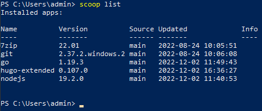

# Getting Started

## Setting up GitHub

You may find the following video useful:

[](https://youtu.be/8Dd7KRpKeaE "Git, GitHub, & GitHub Desktop for beginners")

Essentially, Git is a version control software (VCS) and GitHub is a website that allows us to host our code online.

### Github Account

This account is required for you to collaborate and interact with our codebase. As all profiles and commits are **public**, I highly suggest choosing a professional handle and one that allows reviewers to clearly identify you.

You may also refer to [GitHub's exisiting guides and documentation](https://docs.github.com/en).

## Installing Prerequisite Software

You do not need to install both [Scoop](#scoop-for-windows) and [Homebrew](#homebrew-for-macos). Choose the relevant package manager for the operating system you are working on (Windows or MacOS).

> ❗ Make sure you install a package manager before the rest of the software to prevent unnecessary headaches

### Scoop for Windows

You may refer to [Scoop documentation](https://scoop.sh/).

1. Open Windows Powershell by typing in the search bar:


2. Copy and paste the following code into the command-line (This is optional if you are not running a remote script for the first time):

```powershell
Set-ExecutionPolicy RemoteSigned -Scope CurrentUser
```

3. You may receive a prompt alerting you to the change in execution policy, answer yes to this with Y:


4. Copy and paste the following code into the command-line:

```powershell
irm get.scoop.sh | iex
```

5. Wait for scoop to install


For the following software, you may use [scoop's search function](https://scoop.sh/) to search for the relevant installation commands (in the event that commands listed here are outdated).


### Homebrew for MacOS

You may refer to the [Homebrew documentation](https://brew.sh/).

For the following software, you may use [homebrew's package browser](https://formulae.brew.sh/) to search for the relevant installation commands (in the event that commands listed here are outdated).


### Git

[Git](https://git-scm.com/) is our VCS of choice.

For Windows scoop users, simply input the following in powershell:

```powershell
scoop install git
```

For MacOS homebrew users, simply input the following into the macOS terminal:

```macos
brew install git
```

### Go

A dependency for Hugo-extended.

[Go documentation](https://go.dev/doc/)

For Windows scoop users, simply input the following in powershell:

```powershell
scoop install go
```

For MacOS homebrew users, simply input the following into the macOS terminal:

```macos
brew install go
```

### Hugo-extended

This is the framework used for our website, without which you cannot render your webpage locally.

> ❗ We are using [hugo-extended](https://gohugo.io/documentation/), not base hugo.

For Windows scoop users, simply input the following in powershell:

```powershell
scoop install hugo-extended
```

For MacOS homebrew users, simply input the following into the macOS terminal:

```macos
brew install hugo
```

After installation, check your version of hugo with (for both Windows and macOS):

```powershell
hugo version
```

Ensure that your version of hugo includes `+extended` after its hash:


### Nodejs

May be required for building the server on your local computer.

[Nodejs documentation](https://nodejs.org/en/docs/)

For Windows scoop users, simply input the following in powershell:

```powershell
scoop install nodejs
```

For MacOS homebrew users, simply input the following into the macOS terminal:

```macos
brew install node
```

### Confirm all packages are successfully installed

Use the `list` function for both package managers to identify all the software you have currently installed.

For Windows scoop users, simply input the following in powershell:

```powershell
scoop list
```



For MacOS homebrew users, simply input the following into the macOS terminal:

```macos
brew list
```
