# Making Edits

## Branching

You may wish to refer to `17:02` in the [first video we mentioned](https://youtu.be/8Dd7KRpKeaE?t=1022) for a quick overview on what branching is. 

> ❗ Always create a new branch before making any new changes locally, do not commit directly to `main`. This is a best practice throughout software development.

Here are the steps to creating a branch in GitHub Desktop:

1. On GitHub Desktop, go to `Branch` and click `New branch`.

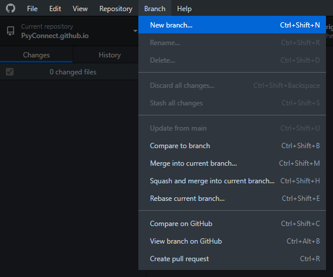

2. Create a name for your new branch. Try to keep them descriptive and relevant to the edits you would be making.

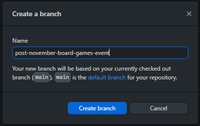

3. Your current branch should now reflect your chosen name for the new branch.

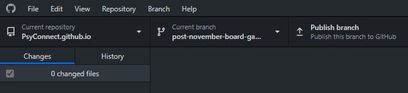

## Content-Specific Edits

If you are here as a member of the social media sub-committee, the following sections will be of relevance to you. It is also time for you to start up your code editor! You will also realise that you do not need to type everything from scratch; Most of what you have to do can be copied from existing files and templates.

### Setting up Visual Studio Code (VSCode/ VSC)

1. On startup, you will be greeted with the `Get Started` page. A few options are available, you would want to use `Open Folder`.

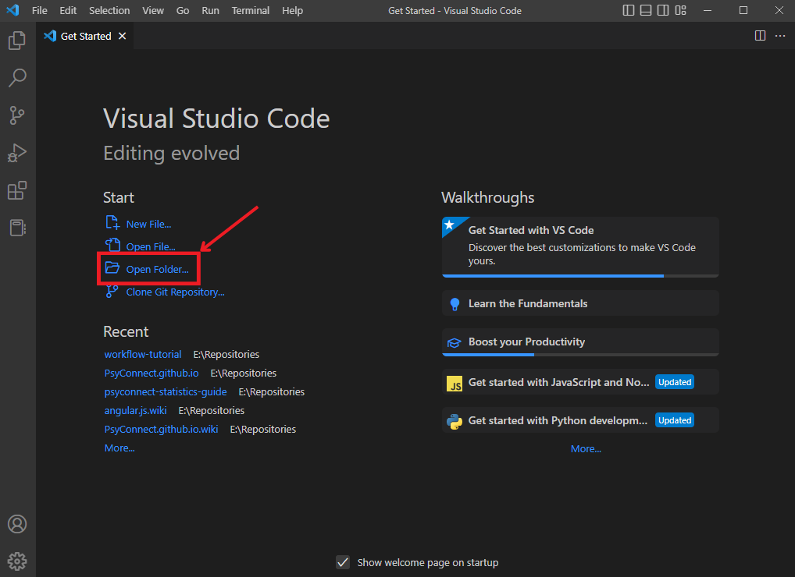

2. This opens the native Windows Explorer. Navigate to the location you saved your local, cloned repository to as specified in [Cloning-the-fork-to-local-computer](Getting-Started.md#cloning-the-fork-to-local-computer). Ensure that the folder selected is correct, i.e., `PsyConnect.github.io`.
   
    (A) This can be achieved by single-clicking the corresponding folder.

    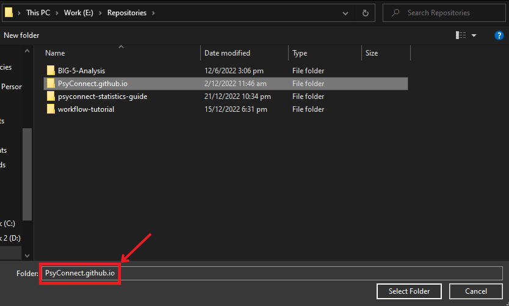

    (B) Or, by double-clicking into the folder.

    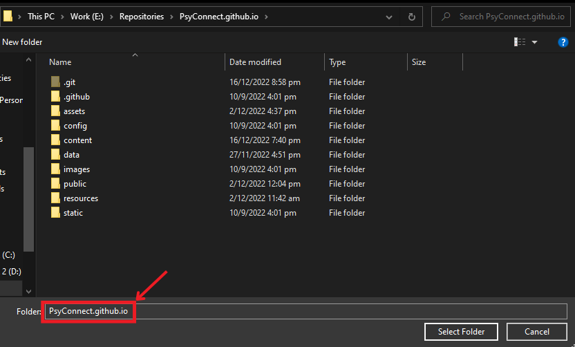

3. Click on `Select Folder`. You should now see the repository's folder structure.

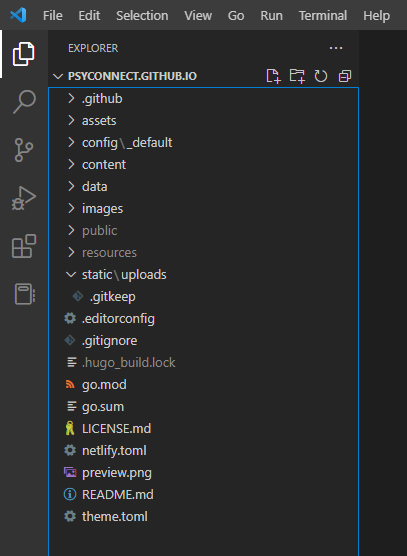

### VSCode Extensions

The base installation of VSCode does not come with  functionalities specific to the programming language you use, this prevents unnecessary downloads for features you don't need. Consequently, you need to install these extensions yourself. Fear not for VSCode has a relatively quick and simple installation process for them.

Suggested extensions:

- bungcip.better-toml
  - Provides syntax highlighting for `.toml` (Tom's Obvious Minimal Language) files
- rusnasonov.vscode-hugo
  - Allows you to locally build and host a `hugo` server
  - i.e., locally view your changes to the website without affecting the live website
- budparr.language-hugo-vscode
  - Provides syntax highlighting and snippets for `hugo` websites
- yzhang.markdown-all-in-one
  - Provides auto preview and other shortcuts for `.md` (Markdown) files
- DavidAnson.vscode-markdownlint
  - Lint (a static code analysis tool used to flag programming errors, bugs, stylistic errors and suspicious constructs) for `.md` (Markdown) files
- natqe.reload
  - Provides a reload button on the bottom right of VSCode.
- tonybaloney.vscode-pets
  - Provides a virtual pet to keep you company when working in VSCode

Here are the steps for installing an extension in VSCode:

1. On the leftmost bar, select the extensions icon.

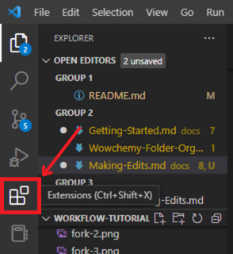

2. Input the extension ID of the aforementioned extensions. e.g., `DavidAnson.vscode-markdownlint`

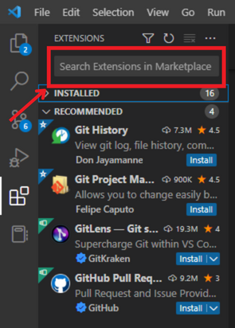

3. Click on the install button.

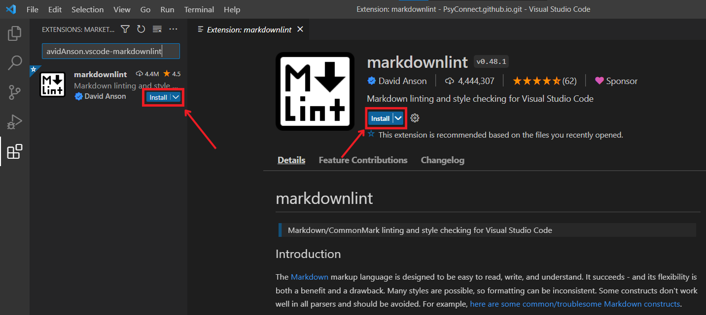

4. Your `install` button should now be replaced with a `disable` and `uninstall` button.

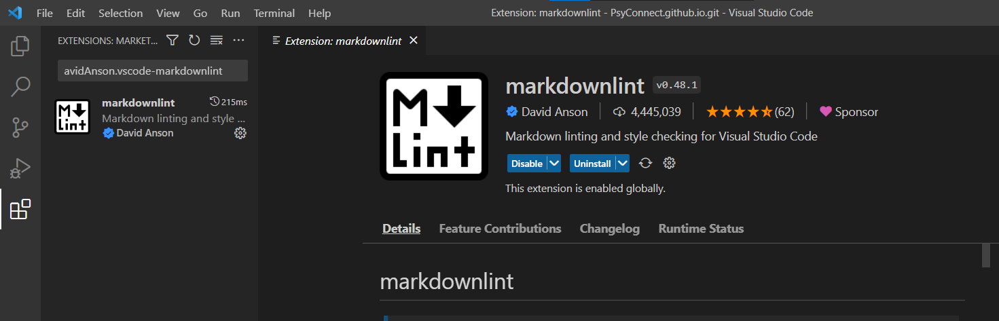

5. Repeat this process for the remaining extensions

6. Reload VSCode to ensure changes take effect. If you have installed `natqe.reload`, there will be a reload button on the bottom right.

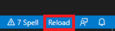

### Creating an event post

1. Navigate to `content/event`.

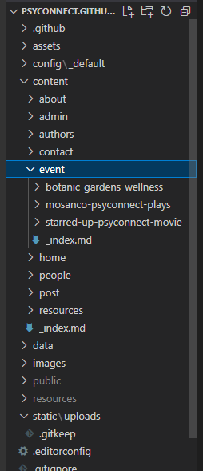

2. You will notice that each individual event has their own folder. Right click any existing event folder (e.g., starred-up-psyconnect-movie) and copy them.

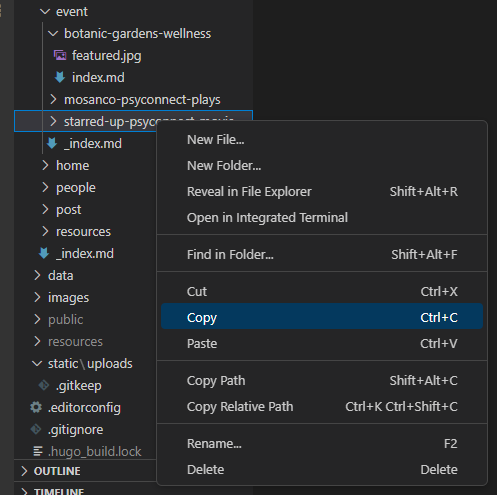

3. Right click the parent `event` folder and paste a copy of the existing event folder.

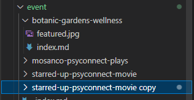

4. Rename the folder to reflect your event (e.g., november-board-games).

> ❗ The folder's name determines the public URL of the page, so ensure that it does not contain anything unprofessional.
> Also note to follow the convention of using `-` in place of spaces.

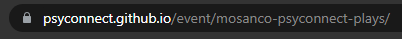

5. Open up the `index.md` file.

6. Replace the existing information. Minimally, the `Title`, `location`, `address`, `date`, `date_end`, and `publishDate` should be filled.

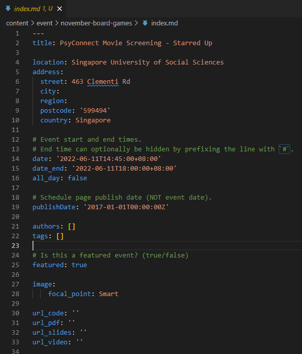

7. For the write-up of the event, place them under the second `---`.

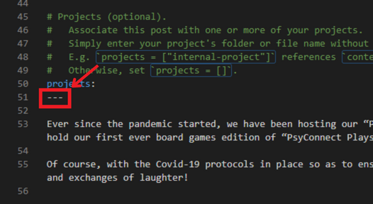

8. For the accompanying picture, replace `featured.jpg` with the image you wish to use. You can replace it with either VSCode's built-in file explorer OR your operating system's file explorer.

> ❗ You **must** use `featured.jpg` as the name of the picture, otherwise hugo will not know which picture to use.

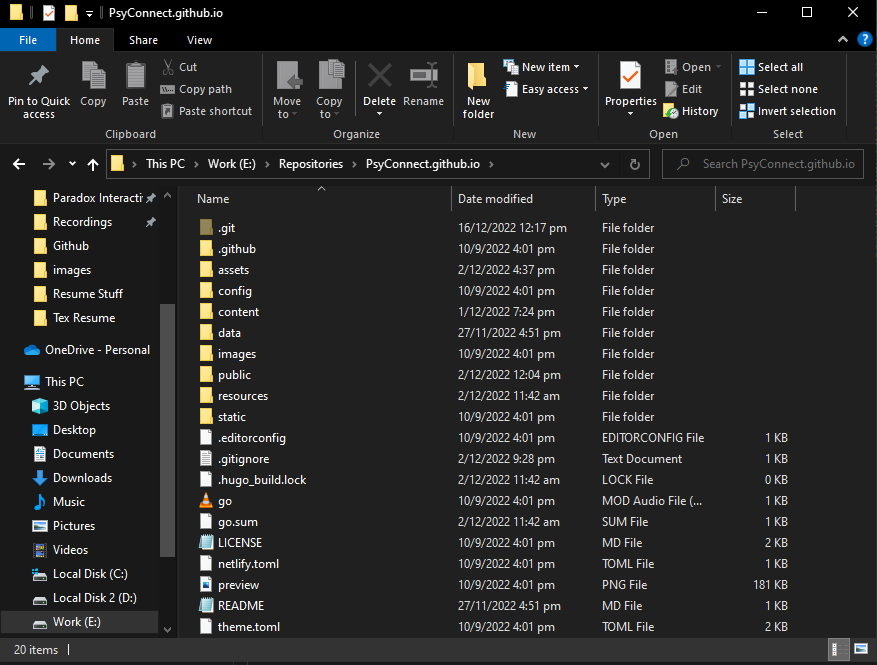

### Creating a resource

1. Navigate to `content/resources`.

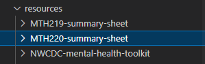

1. Repeat steps 2 to 7 with any existing resource folder and its `index.md`.

> ❗ For resources, minimally `title`, `authors`, `date`, `publishDate`, and `publication_types` must be filled.

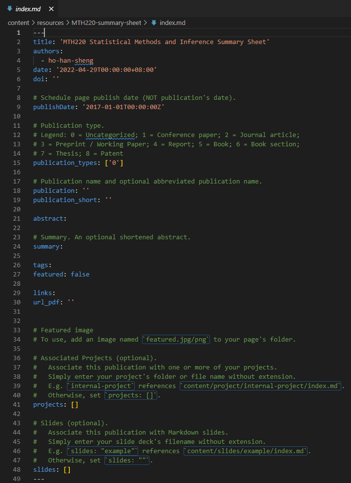

3. For the resource itself (e.g., the PDF file), upload it to the same folder **with the same name as its folder** (e.g., `resources/MTH220-summary-sheet` contains `MTH220-summary-sheet.pdf`). This allows hugo to automatically link the pdf or other files to the current resource post.

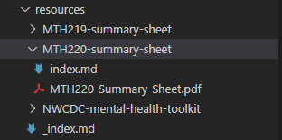

## Checking Changes / Host Local Web Server

Congratulations! You've finished editing and can now view the fruits of your labour. In order to check if your code is workable and the possible visual changes on the website, you need to deploy a local webserver hosting your offline copy of our website.

To do this on VSCode:

1. Ensure all your changes in open editors are saved using the `File/Save` button on the top left or the `Ctrl+S` keyboard shortcut. You should see your edited file highlighted with either an `M` or a `U` for modified and uploaded respectively.

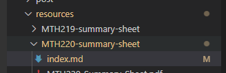

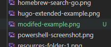

2. Open up VSCode Terminal with the `Terminal` tab.

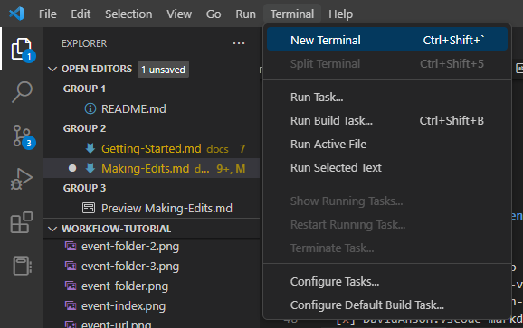

3. A new terminal will show up at the bottom of VSCode.

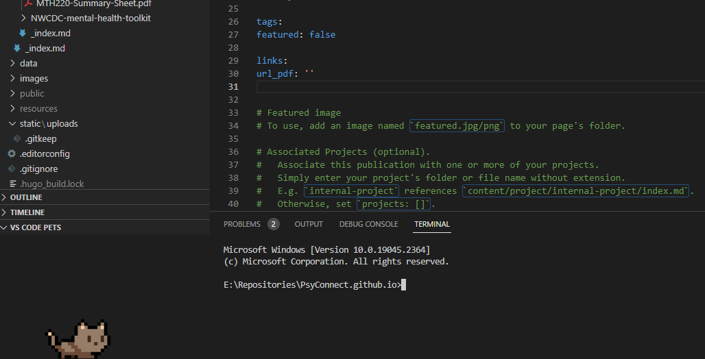

4. Type in `hugo server` to deploy the website.

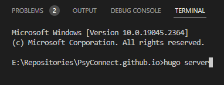

5. The resulting response may be too large for your current window so expand it if you have to. You should receive something similar to the below picture.

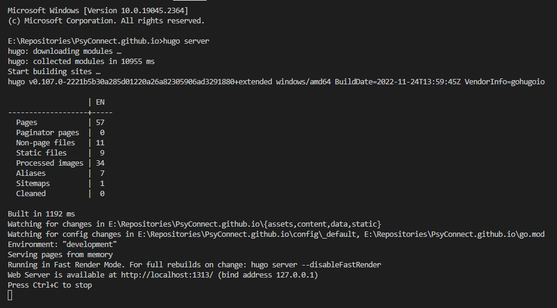

6. Following the last line of the response, open up any web browser and type in `http://localhost:1313/` (or whatever url the response mentions). You should be able to interact with and view your local changes to the website.

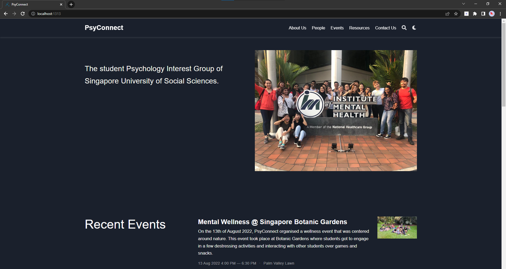

7. Check your changes and ensure that nothing else is unintentionally affected. Use `Ctrl+C` in the same VSCode terminal to stop your web server and continue making edits if you have to. Redeploy the website locally to check your edits again.

Once you are satisfied with your changes, you can now move on to making a commit.
